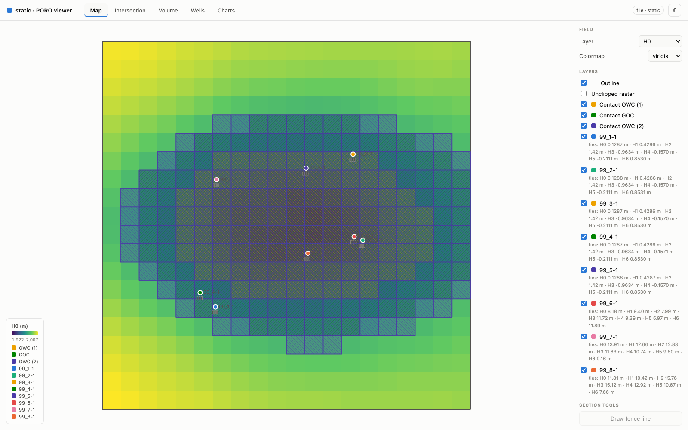
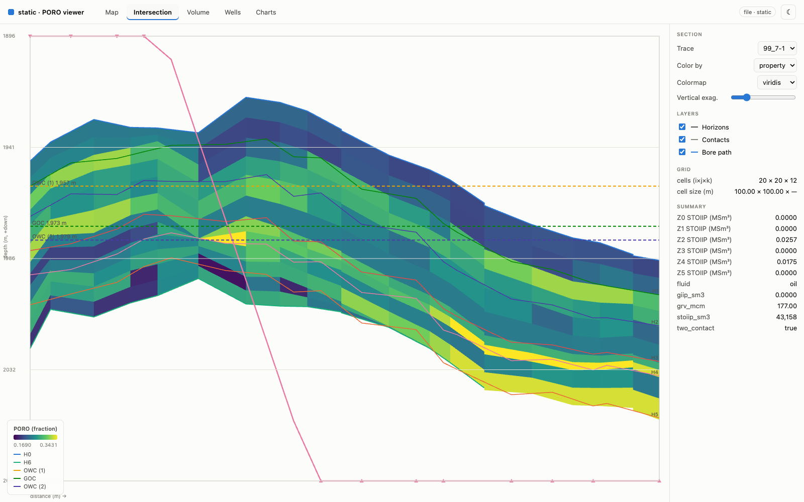
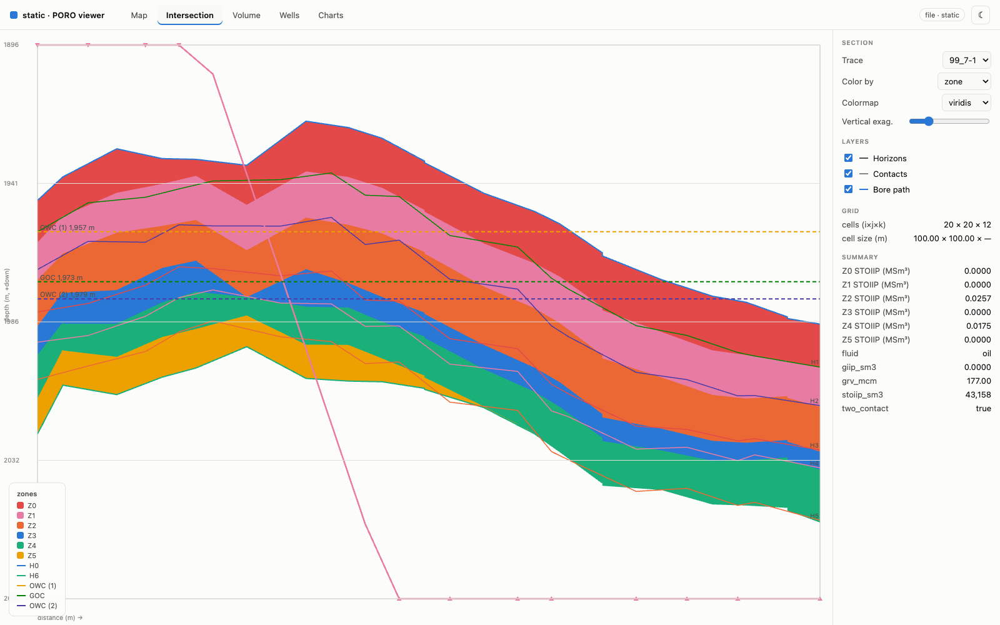
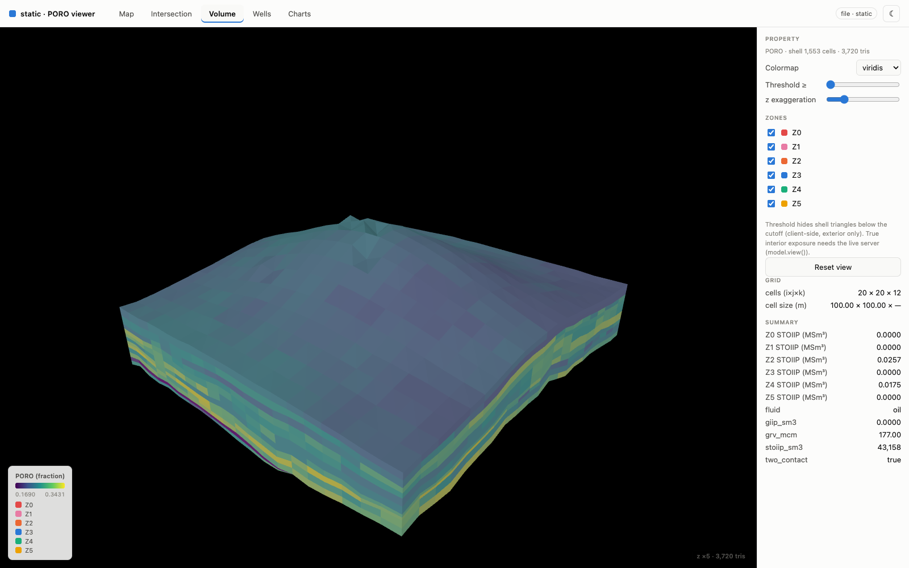
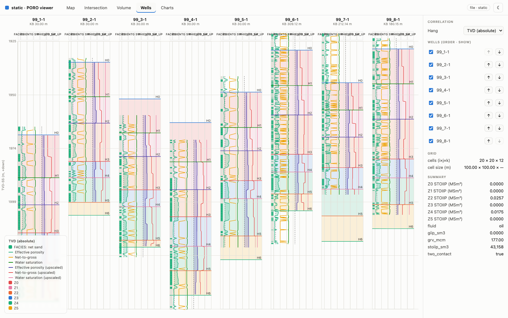
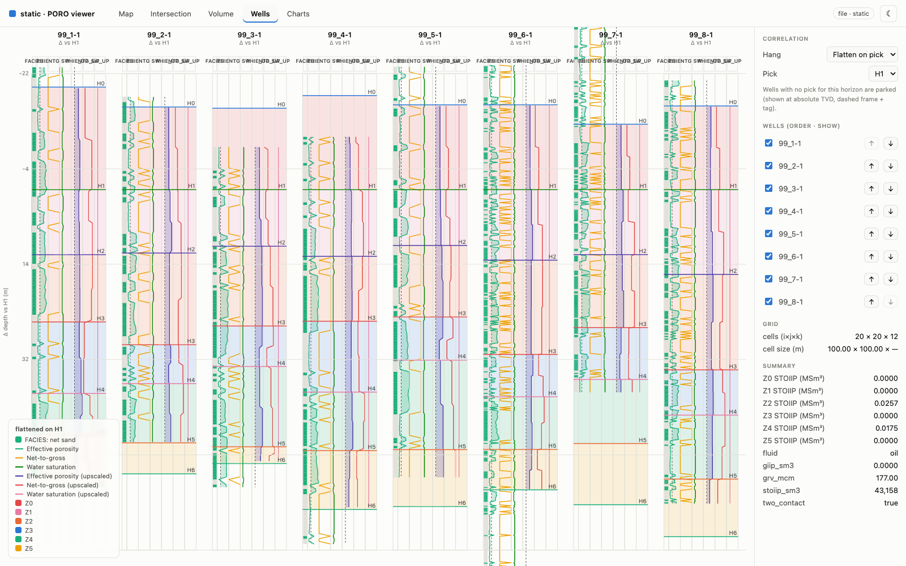
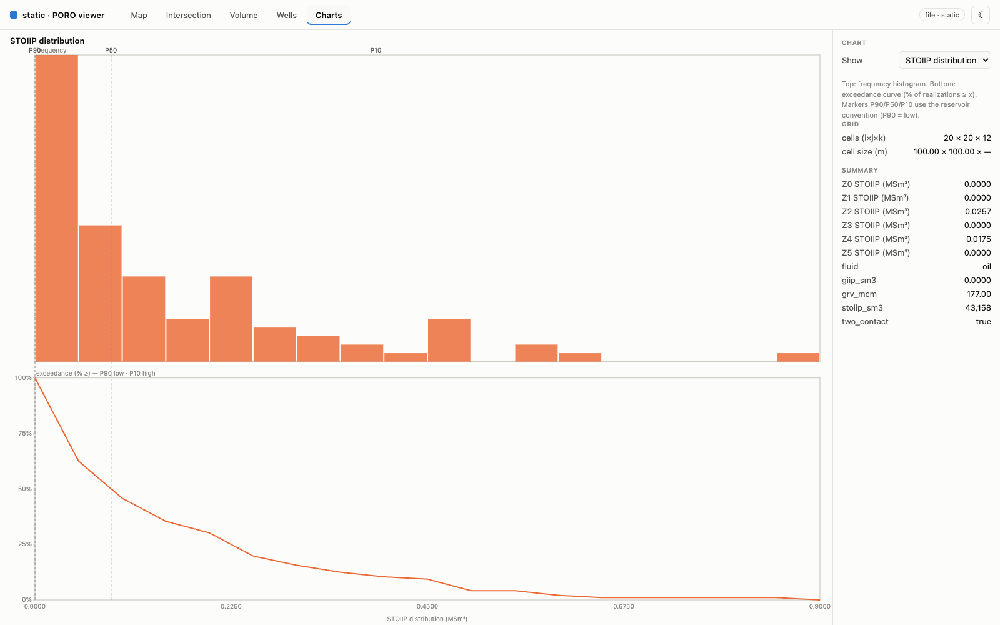
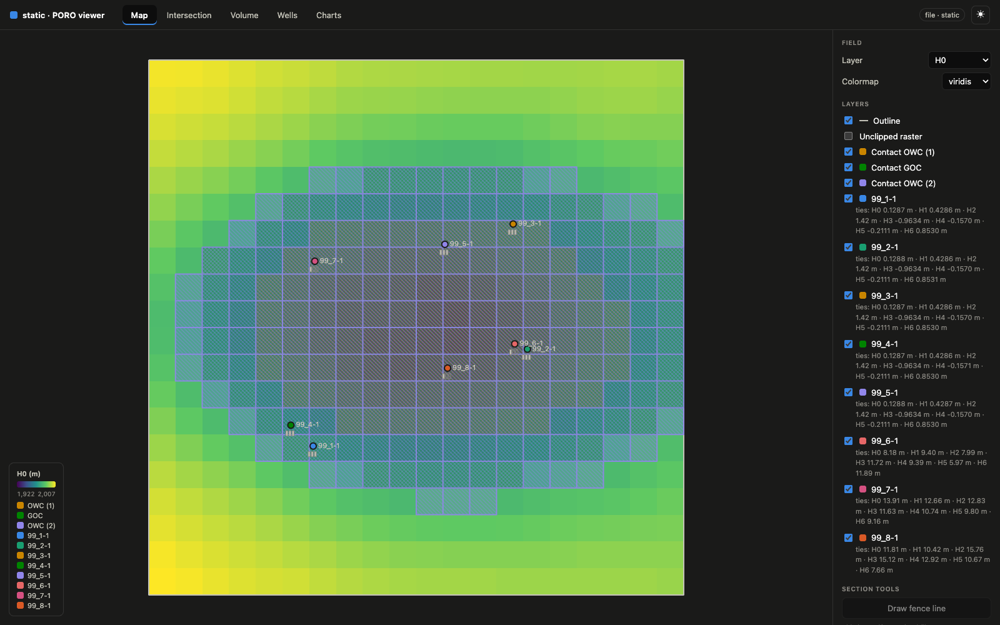
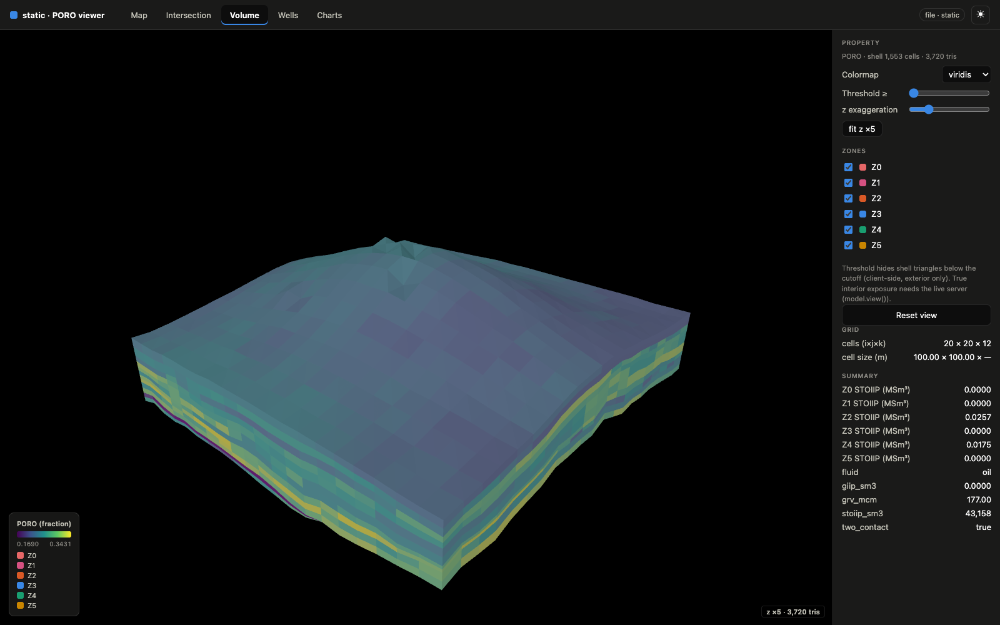
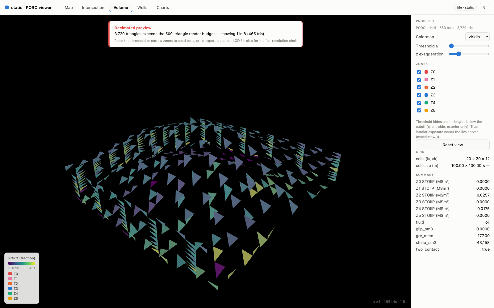

# Gallery

The [viewer](../tutorials/visualization.md) on a **synthetic** asset — every image
below is rendered from `ps.synth_asset` data through `model.save_view(...)`. No
confidential data appears anywhere.

## Map — areal structure

{ loading=lazy }

The Map tab defaults to the top-horizon depth raster, clipped to the outline, with
per-kind contact subcrop masks and well markers.

## Intersection — coloured by property

{ loading=lazy }

A vertical cross-section, each cell a dipping trapezoid following the zone edges,
filled by the property colormap with horizon and contact traces overlaid.

## Intersection — coloured by zone

{ loading=lazy }

The **Color by: zone** select swaps the fill to the fixed categorical zone
identity — the same colour a zone wears in the Volume and Wells tabs.

## Volume — the corner-point shell

{ loading=lazy }

The corner-point cell exterior shell, flat-shaded per cell, with threshold and
z-exaggeration sliders and per-zone toggles.

## Wells — TVD correlation

{ loading=lazy }

Multi-well log correlation on a shared absolute-TVD axis — raw and upscaled curves
per bore, tops as cross-track lines, zones shaded in identity colour.

## Wells — flattened on a pick

{ loading=lazy }

The **flatten-on-pick** mode shifts every well so a chosen horizon aligns at
Δ = 0 — the correlation transform, viewer-side.

## Charts — analytics

{ loading=lazy }

The Charts tab renders pre-computed analytics — tornado sensitivity, the STOIIP
distribution (histogram + exceedance CDF with P90/P50/P10 markers), crossplots.

## Dark mode — map

{ loading=lazy }

Dark mode is **selected, not auto-flipped** — a separately-chosen, CVD- and
contrast-validated palette.

## Dark mode — volume

{ loading=lazy }

The volume shell in dark mode; categorical identity colours are preserved across
the theme flip.

## Volume — graceful auto-degrade

{ loading=lazy }

Past the triangle budget the viewer **auto-degrades** to a decimated preview and
says so in a loud banner — it never crashes, OOMs, or blanks silently.
